# Estatify — Architecture Diagrams

This folder catalogues every architecture view of the Estatify Laravel application.
Each diagram is shipped in three forms:

| Form        | Path                          | Use for                           |
| ----------- | ----------------------------- | --------------------------------- |
| **PNG**     | `docs/diagrams/png/*.png`     | viewing in this README, slides    |
| **SVG**     | `docs/diagrams/svg/*.svg`     | crisp zoom, embeds, dark websites |
| **Python** | `docs/diagrams/src/*.py`      | regenerate after code changes     |

To regenerate everything after a code change:

```bash
python3 docs/diagrams/src/generate.py
for f in docs/diagrams/svg/*.svg; do
  rsvg-convert -z 2 -o "docs/diagrams/png/$(basename "$f" .svg).png" "$f"
done
```

---

## 1. System Context (C4 L1)

Who uses Estatify, what Estatify is, and what external services it touches.

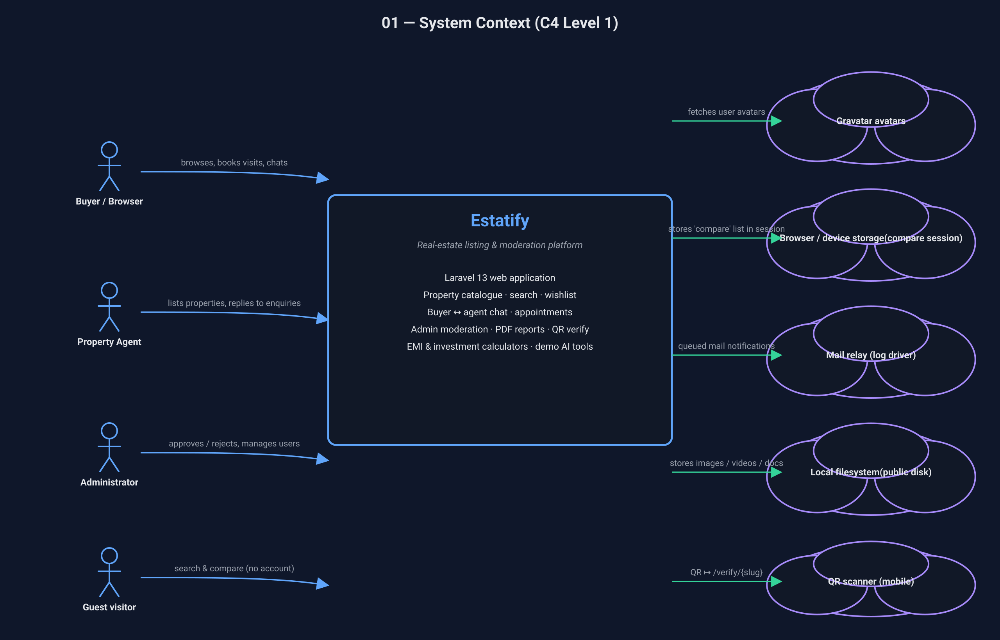

## 2. Container Diagram (C4 L2)

The runnable pieces: browser, Laravel app, queue worker, database, and the
public filesystem disk.

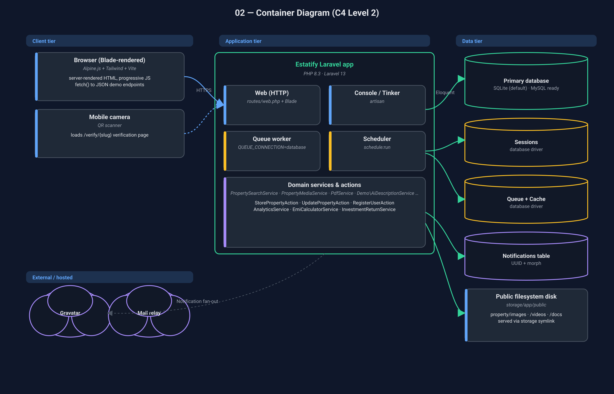

## 3. Component Diagram (C4 L3)

How the HTTP edge resolves down through controllers → actions/services →
Eloquent models → persistence.

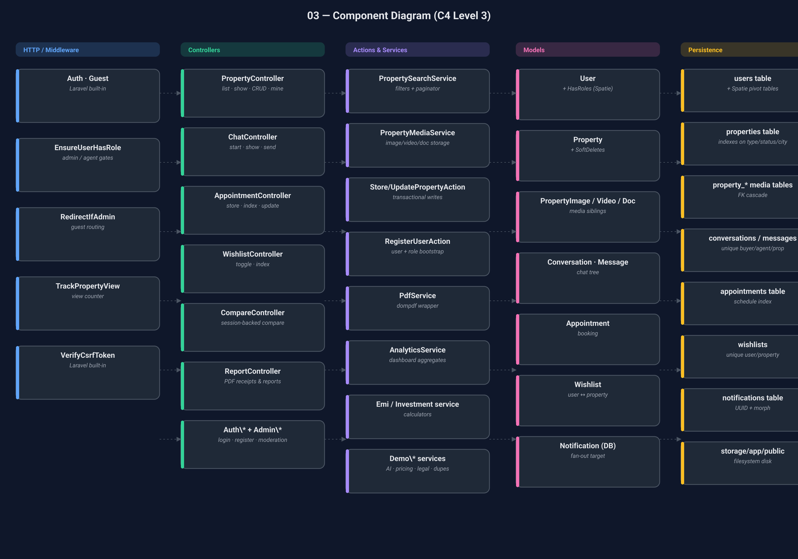

## 4. Layered Architecture

Classic MVC view augmented with the `App\Actions` and `App\Services` tiers
this codebase actually uses.

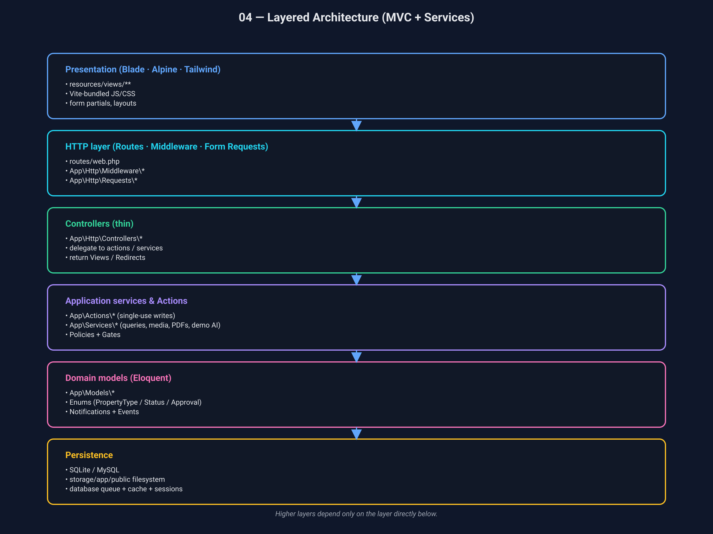

## 5. Package / Module Map

What lives under `app/` and how the namespaces are organised.

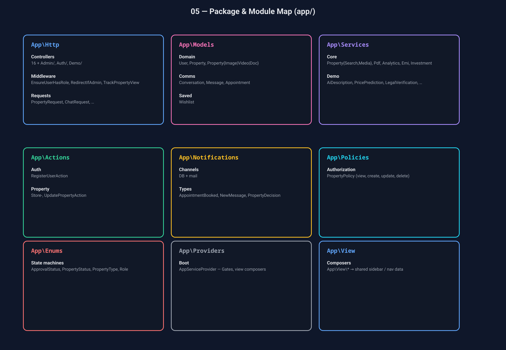

## 6. Entity Relationship Diagram

Database schema lifted from `database/migrations/*`. PK / FK / nullability
are marked on every column.

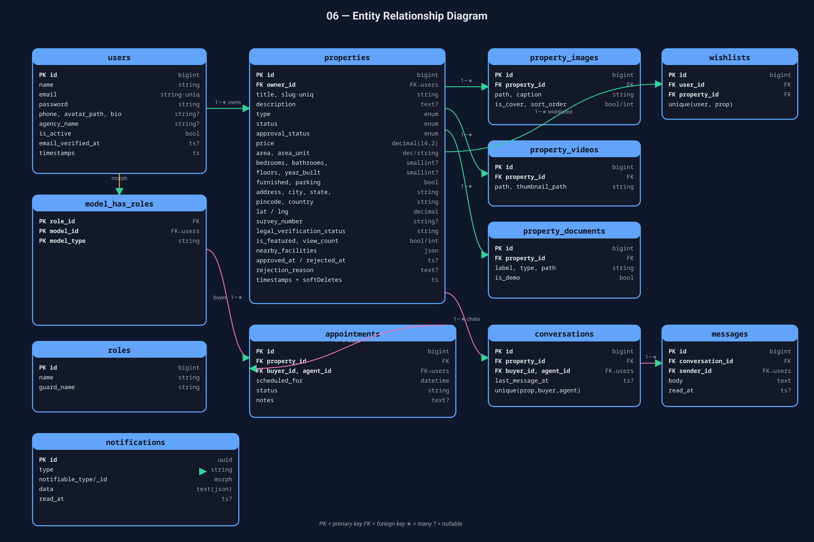

## 7. Eloquent Class Diagram

Domain models, their casts/traits, public methods and the Eloquent
relationships that wire them together.

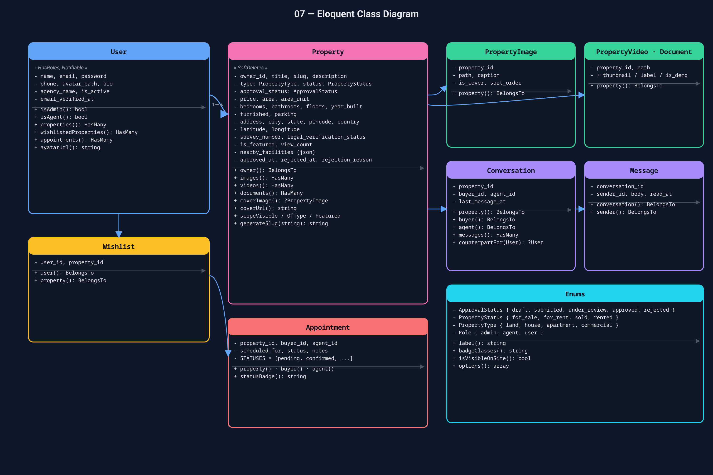

## 8. Use Case Diagram

What each actor (Guest, Buyer, Agent, Admin) can do. Lines from an actor to
an oval mean that actor can drive that use case.

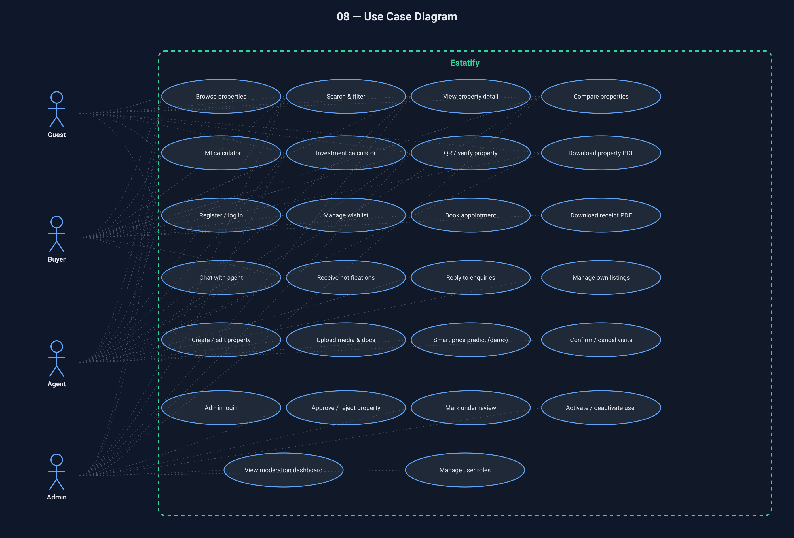

## 9. Sequence — Submit a property

Walk-through of the most important write path:
`POST /properties → StorePropertyAction → DB::transaction { Property + media }`.

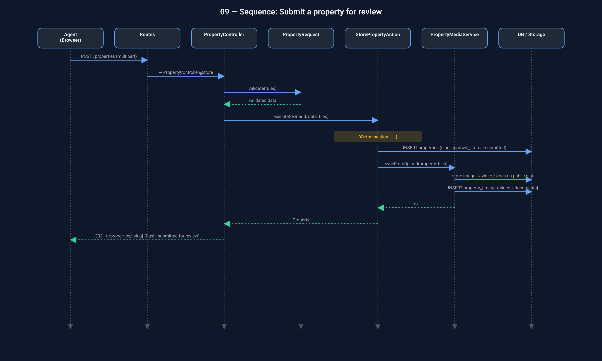

## 10. Sequence — Buyer ↔ Agent chat

Conversation creation and message send, including the notification fan-out.

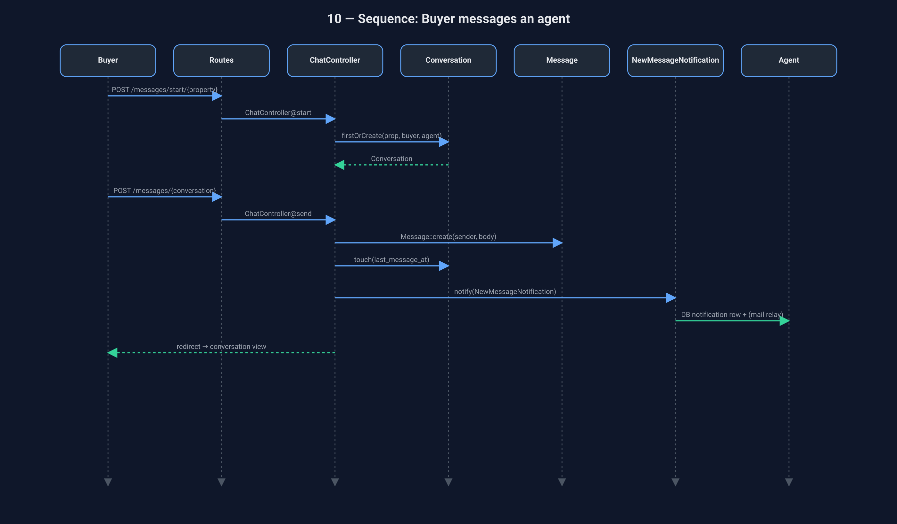

## 11. Property approval state machine

Lifecycle implemented by `ApprovalStatus`: `draft → submitted → under_review
→ approved | rejected`, with `Property::scopeVisible()` only matching
`approved`.

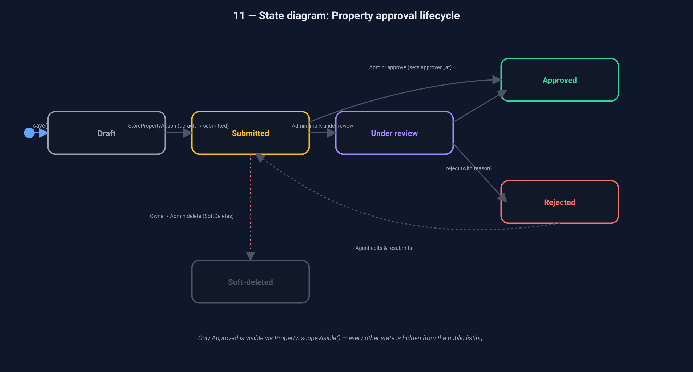

## 12. HTTP Request Lifecycle

How a single request flows through `public/index.php`, middleware, route
resolution, form requests, controller, services, and out as a response.

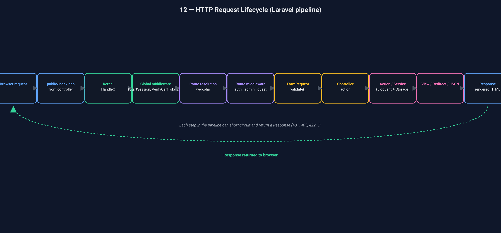

## 13. Deployment Diagram

Single-node baseline: where each piece runs in dev (`artisan serve`) and in
production (php-fpm + nginx + co-located or remote DB).

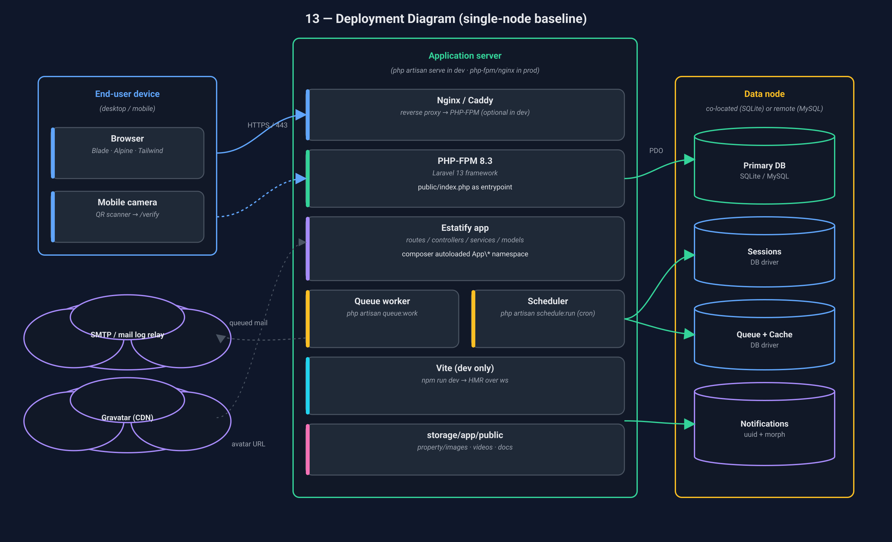
